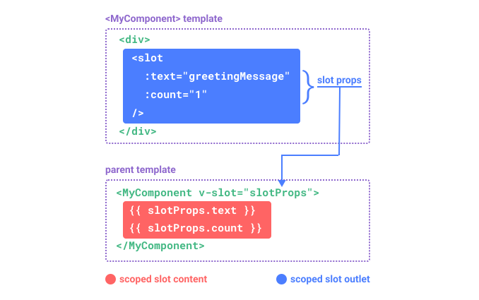

## Vue js optimixation 
### Tree shaking 
 It basic ally deals with the removing of unneccessary code .Try to shi as much less size possible 
 
 #### Tree Shaking vs Code Spiliting
 Tree shaking means only bundling that code that is required example if you dont neesd xyz lib or component thats not shipped and code spilliting means that the code decide to be shipped is break down into smaller and smaller pieces called **chunks** so that browser one big file to load instead small parts are loaded **on demand** **parallel** if its properly used page can be quickly downloaded and the additional chunks (breaken down with the help of chunk) can be loaded later as per the requirement thus dealing with the size effectively .
 
 **For vue js components you can use Async Component**
 
 ### Bolated Bundles
 
 **If using a build step, prefer dependencies that offer ES module formats and are tree-shaking friendly. For example, prefer lodash-es over lodash.**


### Using **sHALLOW ref** to only track **.value**  and not nested property


### Virtualize Large Lists


### Reduce Reactivity Overhead

So since the vue trackes the nested property of object and emaulates the behaviour of the reactivity and you mutate  a  nested object it re-render and tracks which seems great but can be a great performance  issue as it creates too many overheads and because every property access trigger  **proxy trap** and **dependency tracking** . To come out of thus use shallowRef as it commes out or removes the  nested property tracking and you will need to create new copy 


```js

const shallowArray = shallowRef(
    [
        //big list of deep object
    ]
);


shallowArray.value.push() // will not trigger render

shallowArray.value = [
    ...shallowArray.value,
    {
        // it will work
    }
]

```

### Avoid Unnecessary Component Abstractions   
https://vuejs.org/guide/best-practices/performance.html#avoid-unnecessary-component-abstractions


### Reactivity in Depth

In cases  we want to check the detail which reactive value is being changes we can use **onRenderTracked, onRenderTriggered**  **onRenderTracked, onRenderTriggered** and for computed and watch/watchEffect we use **onTrack and onTrigger Method**


## Vue Rendering process
'https://vuejs.org/guide/extras/rendering-mechanism.html'
The vue uses **Virtual DOM** to do it and it a **concept** not qa tech  pioneered by the **React** to keep the dom tree copy in memory and then locating where the changes to be done

The templates are complied to the render function whic return dom  tree

**vnode** is a virtual node for a respective **DOM NOde**

At runtime **Renderer** it will tranverse and accordindly build the **DOM NODES** were created

After the nodes are builded than the **Renderer** might find the difference between old and new dom tree as it will have to find out what part has been chnaged due to **Side Effects** like (Network call , callBack timers , update of state) and render accordindly according the place of change its called **patch or reconcilation**.


At high level this happens :

- Compile: Vue templates are complie into render function  that return the vnode tree  .It can be done complie time , build time , run time or ahead of time as well.

- Mount: These render method is invoked and actual dom Node is created.Here the reactivit dependy also tracked

- Patch: Whenever side effects happens or reatcivity depency triggers the render function is re run and new virtual DOM is created and compared with the old one 


### Template vs Render Function

You can skip the template compalition and dirextly access render function api and they more flexible in nature for high dynamic sort of work and more dynamic logic can be written 

So the virtual DOM implementation part happens only at the run time as the virtual dom can't predicated earlier and every  time some changes happens a whole new dome tree is created and then the **recoil**(diff) algo is used but the extra memory space is used this is the most critized or drawback of this **Vurtual dom** . But vue js optimized it 

## Static Hoisting
The nodes that contain static content are hoisted i.e they are nodes are created outside the render function so that each time they run they are refer to same node and if they are used somewhere else they are **clone**

## Patch Flag
For dynamic  attribute the patch flag are used so to check whether a rework is required or not

## Tree flatting

The vnode will have lots of children and each render ist will have to go through it but thanks to **createElementBlock** function and patch flag only those nodes who are using dynamic value / attribute and are returned as **flattened array** and the exact are vnodes to be target   


### Dom Updating nexttick
As soon as something is updated immedtaley all things  are not pushed to the Dom node in synchholosuly mkanner Vue run a update cycle and all the changes are buffered and updated in that update cycle .To detect the cycle  ` use **nextTick** 


### ref vs reactive

### Shallow Reqactivity

### Shallow ref

### Automatically unwrapping ref

### Downside with reactivity

### Computed property
It use for caching 

- To update something use Writtable computation property.
- Avoid Mutation in the computed property .
- Avoid use asuync or network calls inside the the computred property these are to be done under the **watchers**

**Use of the array mutation methods be avoided inside the copmputation cb function as now sideeffects should be created** 

## Async components
In large component we need  to optize our frontend and we need to ship smaller and required chunks to the user rather than big chunks for what we do we use **defineAsyncComponent** , it provideds the optyions for the **loader error and also supperot ES5 file import support**  . It also support all slot and props support. It proviodes **Suspense Support**
- The Suspense can controll the loading state of the Child Async Component  and its **loading dewaly error timeout** will be **ignored**. You can opt out by using 
```js
{suspensible: false }
```


### Teleport 
Many a time by logical a componenet is a child of the parent component by in the tyerm or point of view it will have a different node like for example of a **modal** you use **<Teleport> component** you provide the **css selector DOM Nodes where you component needs to be injected visually outside the normal Dom** .


### KeepAlive
This component is used to cache component instances when switching to multiple component .So for example:
```js
<template>
    <component :is="activeComponent" />
    
</template>

```
 so wheneve the isActyive is changed the old componet is unkounted and all  its local state is lost.But to cache you can use. 
 
```js
 <KeepAlive>
  <component :is="activeComponent" />
 </KeepAlive>
 ``` 
 So  if the activeComponent contains a form and when it gets unmounted its local state gets deleted as in the first example but in the second exmplae its previous component state are cached. 
 
 You can limit the caching by **name of the componnet  or by the number which follows ""LRU""**
 
 And now consider if you want to detect when the componnet is getting mounted on unmounted which will not be once the componnet is added there are two states for it **Activated and Deactivated** **onActivated()**  **onDeactivated()**


---
### Suspense
The suspense is built in componnet **to handle the Async Depdencied**
- Async Component
- Async Setup (& the await inside <script setup> is considered the same )

It takse the Components as a Default props two more named slots 
**#fallback and #default** 

There are 3 events in slots same as **Promise** 
- Pending
- Resolve
- Rejected


---
## Slots
The slots are a way to inject dynamic content in the child component for exaple you want to add dynamic content in form Lable complnent with a span with * without the help of lsots you might need to do it in hard coded way or via **v-html** which will not as per the needs 
```html
//example

<FormLabel>
<!-- You have Form Label Componet -->
<span @click="someDynamicFunction">Enter Name  </span>
<span>Some Other Dynamic Text/Markup/Content And can access the parent component scope</span>
<YouCanPassSomeCustomComponent />
<IconComponent />
</FormLabel>
```
It make componnets **more re-usable and more dynamic** in nature 

**You can Access Parent Component Scope iBy default in Slots**


There are different Kinds of Slots 

### Named Slots 
Image You creating the Image Couasel (Image Slider) component you need to pass  the Slider Text Content Header and discription via Slots in two different seprate places .
For that you will use **Named Slots**


```html
<!-- Parent Componet -->

<ImageCoursel>
<template #heading></template>
<template #description></template>
</ImageCoursel>

<!-- ------------ -->
<!-- Child Component  -->
<template>
<div class="heading">
    <slot name="heading">
</div>
<div class="description">
    <slot name="description">
</div>
</template>
```

---
### Scopped Slots
As said earlier the content inside will be able to access parent scope within the component .But sometime/ manytime we need to access some of the child Data in that case what to do ??
So in that case the **Child Component will expose the data** and the parent component will access via **v-slot**

#### example
```html
<Child>
<slot v-expose_data="$data.propName" />
</Child>
<Parent>
<Child>
<template #default v-slot="childData">
{{childData.expose_data}}
</template>
</Child>
</Parent>
``` 
